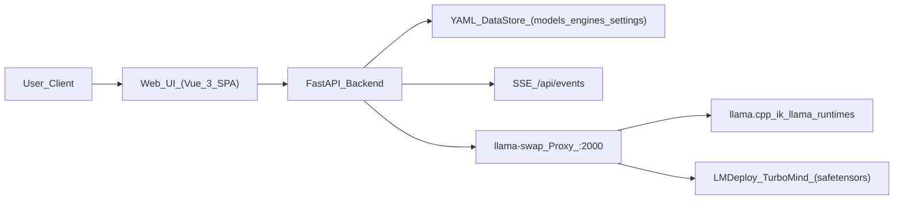

## llama.cpp Studio

llama.cpp Studio is a web-based control plane for running and managing local LLMs on top of `llama.cpp`, `ik_llama.cpp`, and `LMDeploy` – all served through a single OpenAI-compatible endpoint powered by `llama-swap`.

It is designed for **power users running models on a single machine or small server** (Docker or bare metal) with strong support for:

- **CPU-only** inference (OpenBLAS)
- **NVIDIA CUDA GPUs** (via the NVIDIA Container Toolkit)

There is **no built-in support for Vulkan/ROCm/Metal backends** and **no Smart Auto feature** – configuration is explicit and predictable.

### Key capabilities

- **HuggingFace search (GGUF + safetensors)**: Search the Hub, inspect metadata, and plan downloads by quantization or safetensors bundle.
- **Model library with multi-quantization support**: Manage multiple quantizations per base model in a grouped view with start/stop/delete actions.
- **Per-model runtime configuration**: Configure engine (llama.cpp / ik_llama / LMDeploy), context length, GPU layers, batch sizes, and advanced flags.
- **Unified multi-model serving**: Serve many GGUF quantizations at once via `llama-swap` on port `2000`.
- **System & progress monitoring**: Live system stats, GPU information, and unified progress for downloads, builds, CUDA/LMDeploy installs via SSE.

---

## Core concepts & architecture

llama.cpp Studio is a single application composed of a Vue 3 SPA frontend and a FastAPI backend. The backend persists configuration to YAML files under `/app/data` and orchestrates runtimes through `llama-swap`.

### High-level architecture



### Frontend (Vue 3 SPA)

- `App.vue` provides the global shell:
  - Header with llama-swap status and theme toggle
  - Navigation between the main sections
  - Central `<router-view>` for page content
  - Global ConfirmDialog/Toast and SSE connection
- Main views:
  - **Model Library** (`/models`) – installed models grouped by base model and quantization.
  - **Model Search** (`/search`) – HuggingFace search & download (GGUF and safetensors).
  - **Model Config** (`/models/:id/config`) – per-quantization configuration.
  - **Engines & System** (`/engines`) – llama.cpp / ik_llama builds, CUDA and LMDeploy status, system & GPU info.
- State management:
  - `useModelStore` – models, search, downloads, metadata, start/stop/config operations.
  - `useEnginesStore` – engine versions, CUDA installer, system and GPU info.
  - `useProgressStore` – EventSource connection to `/api/events`, normalized tasks, logs, and notifications.

### Backend (FastAPI)

- `backend/main.py`:
  - Ensures the `/app/data` (or local `./data`) directory structure exists and is writable.
  - Initializes the YAML-backed `DataStore` for models, engine versions, and settings.
  - Loads `HUGGINGFACE_API_KEY` from the environment if present.
  - Starts and manages the `llama-swap` proxy on port `2000` when a valid llama.cpp/ik_llama binary is active.
  - Registers all known models with `llama-swap` at startup based on logical metadata (not hard-coded paths).
  - Serves the built Vue app from `frontend/dist` and exposes a catch-all SPA route.
- Key route groups:
  - `/api/models` – model library, HuggingFace search, GGUF/safetensors downloads, configuration, start/stop.
  - `/api/llama-versions` – llama.cpp/ik_llama build settings, builds, version listing, activation, deletion, CUDA installer.
  - `/api/lmdeploy` – LMDeploy install/remove.
  - `/api/status` & `/api/gpu-info` – system and GPU metrics plus `llama-swap` proxy health.
  - `/api/events` – Server-Sent Events stream for unified progress and notifications.

### Runtimes and `llama-swap`

- `llama.cpp` and `ik_llama.cpp` versions are:
  - Built from source under `/app/data/llama-cpp/...`
  - Recorded in the DataStore with metadata and active version selection
  - Exposed to the frontend via `/api/llama-versions`
- `llama-swap`:
  - Is downloaded and installed into the runtime image at build time.
  - Runs a single proxy process on port `2000` and multiplexes multiple model backends.
  - Reads its configuration from files generated by the backend based on stored models and the active engine.
- LMDeploy:
  - Is installed into `/app/data/lmdeploy/venv` from PyPI or source on demand.
  - Serves safetensors checkpoints using TurboMind behind `llama-swap`.

---

## Features

### Model management

- **Unified model library**
  - Models are grouped by HuggingFace repo (e.g. `meta-llama/Meta-Llama-3-8B-Instruct`).
  - Each group contains one or more quantizations (GGUF) and optional safetensors bundles.
  - Per-quantization rows show size, download timestamp, runtime type, and running state.

- **HuggingFace search (GGUF + safetensors)**
  - Search by model name or keyword with a choice of:
    - `gguf` – quantized GGUF files and bundles.
    - `safetensors` – safetensors checkpoints.
  - See metadata (file sizes, quantization names, tags) before you download.

- **Downloads & bundles**
  - GGUF:
    - Download individual quantizations or full bundles.
    - Optionally attach `.mmproj` projector files for multimodal models.
  - Safetensors:
    - Download full safetensors bundles.
  - All downloads are tracked as long-running tasks via SSE and shown in the global progress panel.

### Engine & version management

- **llama.cpp and ik_llama.cpp**
  - Multiple versions per engine are supported.
  - Builds are always **from source**, configured using stored build settings (CUDA flags, flash attention, CPU variants, etc.).
  - Versions can be activated/deactivated; activation updates `llama-swap` configuration automatically.
  - Old versions can be removed to reclaim disk space.

- **CUDA toolkit management (NVIDIA only)**
  - Optional in-container CUDA installer can install or remove the CUDA Toolkit (plus optional cuDNN/TensorRT) under `/app/data/cuda`.
  - Progress and logs for installs/uninstalls are surfaced in the Engines/System view and via SSE events.
  - Only **NVIDIA CUDA + CPU** are documented and supported; other GPU backends are not part of this project’s supported surface.

- **LMDeploy integration**
  - Install LMDeploy from **PyPI** or from **source** into a dedicated virtual environment under `/app/data/lmdeploy/venv`.
  - The backend exposes endpoints to:
    - Check for the latest LMDeploy version.
    - Install/update/remove LMDeploy.
  - Once installed, safetensors models can be launched via LMDeploy TurboMind and are exposed through the same `llama-swap` endpoint.

### Multi-model serving

- **Single OpenAI-compatible endpoint**
  - All models are served via `llama-swap` on `http://<host>:2000`.
  - The proxy implements standard OpenAI-style `/v1/chat/completions` and `/v1/models`.

- **Concurrent GGUF quantizations**
  - Multiple GGUF quantizations can be active at once behind `llama-swap`.
  - The System Status view shows running models and basic health information.

- **Safetensors via LMDeploy**
  - One LMDeploy runtime is supported at a time for safetensors models.
  - It is exposed alongside GGUF models through the same `llama-swap` API.

### Monitoring & progress

- **System & GPU status**
  - `/api/status` reports CPU, memory, disk utilization, running model instances, and `llama-swap` proxy health.
  - `/api/gpu-info` reports detected GPUs and their capabilities (focused on NVIDIA/CUDA).

- **Unified progress tracking**
  - `/api/events` streams:
    - Download progress and completion events.
    - llama.cpp/ik_llama source build progress.
    - CUDA toolkit installation/uninstallation status and logs.
    - LMDeploy installation status and logs.
    - Notifications related to long-running tasks.

---

## Quick start (Docker)

The recommended way to run llama.cpp Studio is via Docker Compose. All examples assume you’ve cloned the repository.

### 1. Clone the repo

```bash
git clone <repository-url>
cd llama-cpp-studio
```

### 2. CPU-focused development (hot reload backend)

Use the CPU compose file (`docker-compose.cpu.yml`) during development. It mounts the backend source and enables reload:

```bash
docker-compose -f docker-compose.cpu.yml up --build
```

This will:

- Expose the web UI and API at `http://localhost:8080`.
- Expose the `llama-swap` proxy at `http://localhost:2000`.
- Mount `./data` to `/app/data` so models, configs, and logs persist between runs.

### 3. GPU mode (NVIDIA CUDA)

For NVIDIA GPUs with the NVIDIA Container Toolkit installed on the host:

```bash
docker-compose -f docker-compose.cuda.yml up --build -d
```

This will:

- Build the image from the current source tree.
- Map:
  - `8080:8080` – web UI + FastAPI backend
  - `2000:2000` – `llama-swap` OpenAI-compatible endpoint
- Mount `./data` to `/app/data`.
- Reserve all GPUs for the container using the Compose `deploy.resources.reservations.devices` section.

### 4. Manual Docker build and run

You can also build and run the container without Compose:

```bash
# Build the image
docker build -t llama-cpp-studio .

# GPU-capable run (NVIDIA)
docker run -d \
  --name llama-cpp-studio \
  --gpus all \
  -p 8080:8080 \
  -p 2000:2000 \
  -v ./data:/app/data \
  llama-cpp-studio

# CPU-only run
docker run -d \
  --name llama-cpp-studio-cpu \
  -p 8080:8080 \
  -p 2000:2000 \
  -e CUDA_VISIBLE_DEVICES="" \
  -v ./data:/app/data \
  llama-cpp-studio
```

### 5. Published images

If you prefer pulling from a registry, use the GitHub Container Registry image published by this project (replace `<org-or-user>` with the correct namespace):

```bash
docker pull ghcr.io/<org-or-user>/llama-cpp-studio:latest
```

Run it with the same ports and volume mapping as above.

---

## Configuration

### Environment variables

Common environment variables for the backend:

- **`HUGGINGFACE_API_KEY`** – HuggingFace token used for model search and download.
  - When set via environment variable, the UI treats it as read-only and shows only a masked preview.
- **`CUDA_VISIBLE_DEVICES`** – controls which GPUs are visible to the container:
  - Default in Compose is `all`.
  - Set to `""` (empty string) for CPU-only runs.
- **`HF_HOME`** and **`HUGGINGFACE_HUB_CACHE`** – location for the HuggingFace cache:
  - Default to `/app/data/hf-cache` and `/app/data/hf-cache/hub` so cache data is persisted in the volume.
- **`BACKEND_CORS_ORIGINS`**, **`BACKEND_CORS_ALLOW_CREDENTIALS`** – advanced CORS options for custom setups.
- **`RELOAD`** – when running the backend directly, controls uvicorn reload behavior (`true` in local dev, `false` in Docker).

These can be set directly in `docker-compose.yml` or via an `.env` file referenced by Compose.

### Data & volumes

The image expects a writable data directory at `/app/data`, typically mapped from `./data` on the host:

- **Models** – GGUF files and safetensors bundles.
- **Config** – YAML files for models, engines, and other settings.
- **Logs** – backend logs, build logs, installer logs.
- **llama.cpp builds** – source trees and build outputs.
- **CUDA toolkit** – if installed, under `/app/data/cuda`.
- **LMDeploy virtualenv** – under `/app/data/lmdeploy/venv`.

Recommended Compose mapping:

```yaml
volumes:
  - ./data:/app/data
```

### HuggingFace token

You can provide your HuggingFace token in multiple ways:

- **Directly in Compose** (keep this private):

```yaml
environment:
  - HUGGINGFACE_API_KEY=your_huggingface_token_here
```

- **`.env` file** (not committed to git):

```bash
HUGGINGFACE_API_KEY=your_huggingface_token_here
```

Then in Compose:

```yaml
env_file:
  - .env
```

Once configured, the Model Search UI will use this token transparently.

---

## Using the web UI

### Model search & download

- Open the **Model Search** view.
- Enter a HuggingFace repo name or search term, choose:
  - `gguf` – to browse GGUF quantizations and bundles.
  - `safetensors` – to browse safetensors bundles.
- Expand a result to:
  - Inspect file sizes and quantization names.
  - See optional projector (`.mmproj`) files for multimodal models.
- Click **Download** to start a download; progress will appear in the global progress panel.

### Model library

- Open the **Model Library** view (`/models`).
- Each card groups all quantizations for a base model:
  - GGUF quantizations (different sizes and quant schemes).
  - Safetensors bundles (if present).
- Per-row actions:
  - **Start** / **Stop** – launch or stop a model via `llama-swap`.
  - **Configure** – open the per-quantization configuration screen.
  - **Delete** – remove a specific quantization.
- Group-level actions let you delete entire model groups to reclaim disk space.

### Per-model configuration

- From the library, click **Configure** on a quantization.
- Choose an engine:
  - `llama.cpp` or `ik_llama.cpp` for GGUF.
  - `LMDeploy` for safetensors.
- Adjust:
  - Context length.
  - GPU layers (`-ngl`-style behavior).
  - Batch sizes and other llama.cpp/LMDeploy flags.
- Advanced options are rendered from a parameter registry maintained on the backend, allowing you to set engine-specific flags explicitly.

### Engines and CUDA

- Open the **Engines & System** view (`/engines`) to:
  - View and manage **llama.cpp** and **ik_llama.cpp** versions:
    - Build from source using saved build settings (e.g. CUDA on/off).
    - Activate a version (updates `llama-swap` configuration).
    - Delete non-active versions to free disk.
  - Manage **CUDA toolkit** in the container:
    - Install or uninstall specific CUDA versions.
    - See status and detailed logs.
  - Manage **LMDeploy**:
    - Install from PyPI or a git branch.
    - Remove LMDeploy and its virtualenv.
    - Tail installer logs for debugging.

All of these actions surface their progress and logs in the unified progress UI.

### System status & monitoring

- The header shows a concise llama-swap status indicator (health and port).
- The System section displays:
  - CPU, memory, and disk usage.
  - Detected NVIDIA GPUs and key characteristics.
  - Currently running models as reported by `llama-swap`.

---

## OpenAI-compatible API (high level)

Once at least one model is running, you can call the `llama-swap` proxy directly.

- **Base URL**: `http://<host>:2000`
- **Chat completions**:

```bash
curl http://localhost:2000/v1/chat/completions \
  -H "Content-Type: application/json" \
  -d '{
    "model": "your-model-name",
    "messages": [{"role": "user", "content": "Hello!"}]
  }'
```

- **Model listing**: `GET http://localhost:2000/v1/models`
- **Health**: `GET http://localhost:2000/health`

Model IDs are shown in the System Status view and in the Model Library when a model is running.

---

## Troubleshooting & logs

### Common issues

- **GPU not detected**
  - Ensure the NVIDIA Container Toolkit is installed and `nvidia-smi` works on the host.
  - Use `--gpus all` (docker run) or the `deploy.resources.reservations.devices` stanza in Compose.
  - Confirm `CUDA_VISIBLE_DEVICES` is not set to `""` when you intend to use the GPU.

- **Build failures (llama.cpp / ik_llama / CUDA)**
  - Check that you have enough disk space (≥ 10 GB free is a good baseline).
  - Verify CUDA and driver versions are compatible with the chosen build settings.
  - Review build or installer logs (via the progress UI or log files in `/app/data/logs`).

- **Memory errors / out-of-memory**
  - Reduce context length and/or batch size for the model configuration.
  - For GPU runs, lower GPU layers or choose a smaller quantization.

- **Model download failures**
  - Verify HuggingFace connectivity and model visibility (public/private).
  - Ensure `HUGGINGFACE_API_KEY` is correctly configured for private models.
  - Check free space under `/app/data`.

- **llama-swap**
  - Hit `http://localhost:2000/health` and `http://localhost:2000/v1/models` to check proxy state.

### Logs

- **Container logs**:

```bash
docker logs llama-cpp-studio
```

- **Backend and task logs**: stored under `/app/data/logs` and surfaced via `/api/events`.
- **CUDA installer logs**: available via CUDA log endpoints and the Engines/System view.

---

## Development & testing

### Backend (FastAPI)

- The backend code lives under `backend/`.
- To run the backend directly in development:

```bash
cd backend
pip install -r ../requirements.txt
uvicorn main:app --reload --port 8080
```

### Frontend (Vue 3 + Vite)

- The frontend SPA lives under `frontend/`.

```bash
cd frontend
npm install
npm run dev
```

The dev server (typically on port `5173`) is configured to proxy API calls to the backend.

### Backend tests

```bash
pip install -r requirements.txt pytest pytest-asyncio
PYTHONPATH=. pytest backend/tests -v
```

The test suite includes:

- Smoke tests to ensure the app boots and key routes (`/api/status`, `/api/models`, `/api/llama-versions`, `/api/events`) respond.
- Tests for LMDeploy management and configuration.
- Tests for CUDA installer flows and model introspection logic.

---

## License

This project is licensed under the MIT License – see the `LICENSE` file for details.

---

## Contributing & support

### Contributing

- Fork the repository.
- Create a feature branch.
- Make your changes and add tests where appropriate.
- Open a pull request describing your changes and how you tested them.

### Support

- Open an issue on GitHub for bugs or feature requests.
- Review this README and the troubleshooting section before filing.

### Acknowledgments

- **llama.cpp** – core inference engine.
- **llama-swap** – multi-model serving proxy.
- **HuggingFace** – model hosting and search.
- **Vue.js** – frontend framework.
- **FastAPI** – backend framework.

